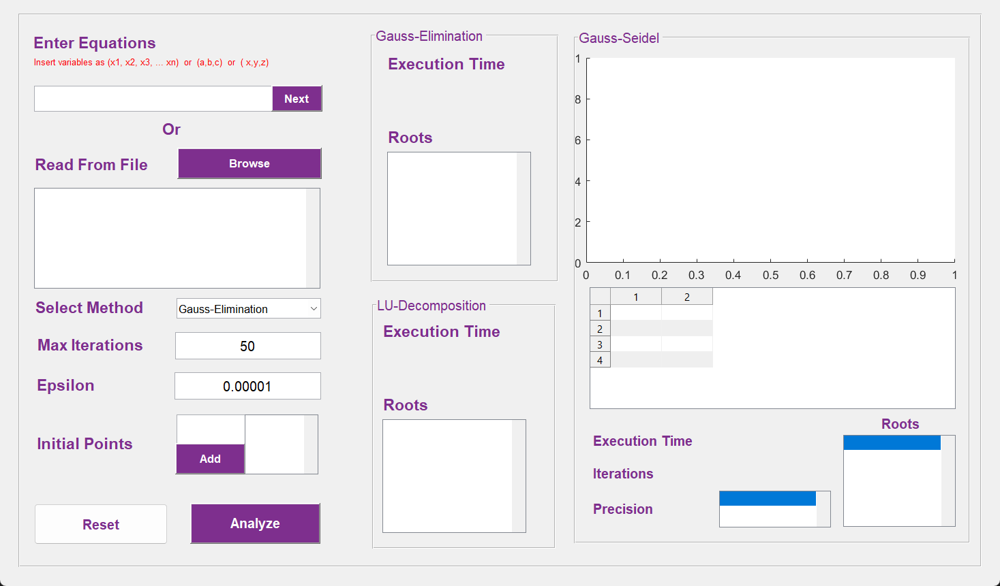

# Matrix Solving Techinques Using Matlab 🔢📈

**Project on using MATLAB to solve matrices using various techniques like Gaussian elimination and LU decomposition, for real-world problems. Matrix solving is important in various fields, and this project will help deepen understanding and apply MATLAB to solve matrices.**

## Explaination 📖

### Why we need different techinques to solve a matrix?

Matrix solving is a crucial aspect of linear algebra and plays a major role in fields like engineering, physics, and finance. This project presents an opportunity to gain a deeper understanding of various matrix solving techniques and to apply them using MATLAB. By comparing the performance and accuracy of different methods, the project provides insights into the best approach for solving matrices in different situations.

### Numerical Methods to solve equations 🚀

- Gauss-Seidel
- Gauss-Elimination
- LU Decomposition

### Code Need to Know 📊

> You can find the implementation of each code and it's psuedocode in the techinques.m

## UI :iphone:

* Further Cases can be found in the report associated with the project. Feel free to expriment yourself or add other Demos.

## Table of contents :label:

| File Name                                                                                                           | Description                                                       |
| ------------------------------------------------------------------------------------------------------------------- | ----------------------------------------------------------------- |
| [techinques.m](https://github.com/XMaroRadoX/Matrix-Solving-Techinques-Using-Matlab/blob/master/techniques.m) | Contains matlab code of functions implementation. |
| [Figure.m](https://github.com/XMaroRadoX/Matrix-Solving-Techinques-Using-Matlab/blob/master/Figure.m)             | Contains matlab code of Visuals.                                          |
| [test.txt](https://github.com/XMaroRadoX/Matrix-Solving-Techinques-Using-Matlab/blob/master/test.txt) | Contians a sample run for the user to test|

### Pre-requisites :screwdriver:

- Matlab

### Run :green_circle:

- Open Directory in matlab
- Run The Figure

### Licensing :pencil:

This code is licensed under the MIT License.

### Authors :pen:

- Marwan Radwan
- Mariam Atef Hassan
- Sarah Sherien Abdel-Fattah
- Yasmine Emad

### Contribution :clinking_glasses:

Feel free to contribute just make a pull request and do what you wish. 😼

